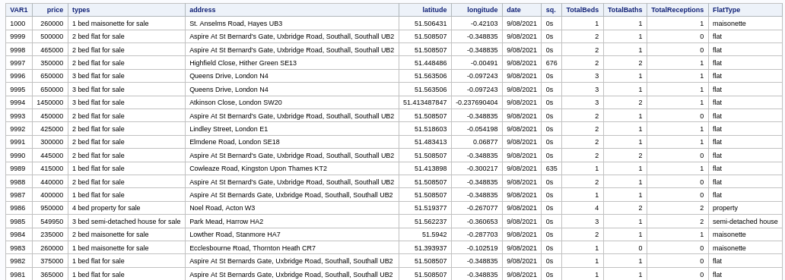
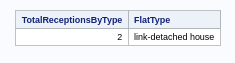
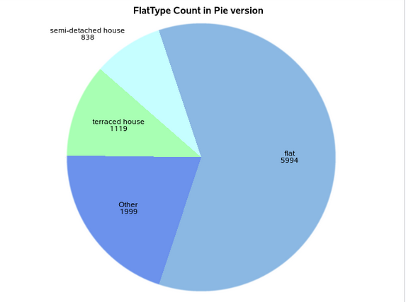
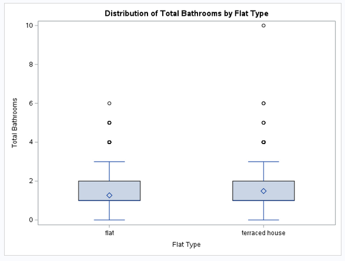
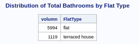
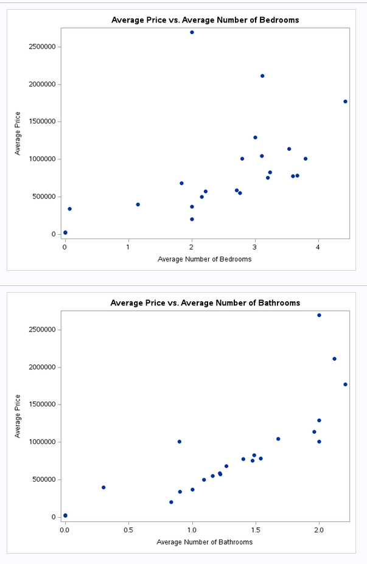

# Import data

```sas
/* Import */
PROC IMPORT
	out=ASM.Housing
	datafile='/home/u64002637/ASM/Project_Housing.csv'
	dbms=csv
	replace;
RUN;
```

### Q1: Generate Last 20 Rows of Processed Renting Post Records
```sas
/* Q1 */
PROC SQL OUTOBS=20;
	select * from ASM.Housing ORDER BY monotonic() desc;
QUIT;
RUN;
```


**Explanation:** This query retrieves the last 20 records from the `ASM.Housing` dataset by ordering the entries in descending order using a monotonic function, which gives a unique number to each row. 

### Q2: Average Number of Receptions by Property Type
```sas
/* Q2 */
PROC SQL outobs=1;
	select avg(TotalReceptions) as TotalReceptionsByType, 
		FlatType from ASM.Housing
	group by FlatType
	order by TotalReceptionsByType desc;
QUIT;
RUN;
```



**Explanation:** This query calculates the average number of receptions for each property type (`FlatType`). It groups the data by property type and sorts the result to find which type has the highest average number of receptions. The `outobs=1` limits the result to the top entry.

**Answer**: The average number of receptions by property type for a "link-detached house" is 2.

### Q3: Contribution of House Type and Most Common Property Type
```sas
/* Q3 */
PROC SQL;
	create table FlatTypeFreq as 
	select count(VAR1) as freq, FlatType from ASM.Housing group by FlatType order by freq desc;
QUIT;

proc sgpie data=FlatTypeFreq;
	title "FlatType Count in Pie version";
	pie FlatType / response=freq;
run;
```



**Explanation:** This code creates a frequency table of property types, counting how many entries correspond to each type. The results are then visualized in a pie chart to clearly show the distribution of property types, helping identify the most common type.

**Answer**: The most common property type is flat, with a frequency of 5,994 entries. The pie chart visually represents the distribution of property types, showing the contributions of each type.

### Q4: Distribution of Bathrooms Between Flats and Terraced Houses
```sas
/* Q4 */
data _null_;
	put 'Question 4';
run;
PROC SQL;
    create table BathDistribution as
    select FlatType, 
           TotalBaths
    from ASM.Housing
    where FlatType in ('flat', 'terraced house')
    group by FlatType;
QUIT;
proc sgplot data=BathDistribution;
    title "Distribution of Total Bathrooms by Flat Type";
    vbox TotalBaths / category=FlatType;
    xaxis label="Flat Type";
    yaxis label="Total Bathrooms";
run;
```



**Explanation:** This query extracts the number of bathrooms for flats and terraced houses, organizing the data by property type. The box plot visualizes the distribution of bathroom counts, allowing comparison between the two property types.

**Answer**:
- **Flats**: Typically have a wider range of bathroom counts which is 0-4, with some outliers. Lower Median.
- **Terraced Houses**: Same as Flats, have a wider range of bathroom counts(0-4), with some outliers but higher median.

### Q5: Property Type with Second Most Turnover
```sas
/* Q5 */
PROC SQL outobs=2;
	select count(VAR1) as volumn, FlatType 
	from ASM.Housing group by FlatType order by volumn desc;
QUIT;
RUN;
```



**Explanation:** This query counts the number of records for each property type to determine turnover. By ordering the results in descending order and limiting the output to two entries, it identifies the property type with the second most records.

**Answer**
- The terraced house ranks second, with 1,119 records.


### Q6: Relationship Between Bedrooms, Bathrooms, and Average Price
```sas
/* Q6 */
PROC SQL;
	create table TypeRelevent as
	select avg(price) as avg_price, 
		avg(TotalBeds) as avg_beds, 
		avg(TotalBaths) as avg_baths, FlatType from ASM.Housing
	group by FlatType order by avg_price;
QUIT;
run;

proc sgplot data=TypeRelevent;
    scatter x=avg_beds y=avg_price / markerattrs=(symbol=circlefilled);
    title "Average Price vs. Average Number of Bedrooms";
    xaxis label="Average Number of Bedrooms";
    yaxis label="Average Price";
run;

proc sgplot data=TypeRelevent;
    scatter x=avg_baths y=avg_price / markerattrs=(symbol=circlefilled);
    title "Average Price vs. Average Number of Bathrooms";
    xaxis label="Average Number of Bathrooms";
    yaxis label="Average Price";
run;
```



**Explanation:** This set of queries calculates the average price, number of bedrooms, and number of bathrooms for each property type. The results are visualized using scatter plots to explore potential relationships between average price and the average number of bedrooms and bathrooms, aiding in understanding pricing trends based on property features.

**Analyze**: 
1. **Average Price vs. Average Number of Bedrooms**:
   - The scatter plot suggests a positive correlation between the number of bedrooms and the average price. As the average number of bedrooms increases, the average price tends to rise as well. This indicates that properties with more bedrooms generally command higher prices.

2. **Average Price vs. Average Number of Bathrooms**:
   - Similarly, the second scatter plot shows a positive correlation between the number of bathrooms and the average price. Properties with more bathrooms also tend to have higher average prices, reinforcing the idea that additional amenities can significantly influence property values.

### Conclusion
Both plots indicate that there is a relationship between the number of bedrooms, the number of bathrooms, and the average price of properties. More bedrooms and bathrooms are associated with higher average prices, which aligns with common real estate trends. 